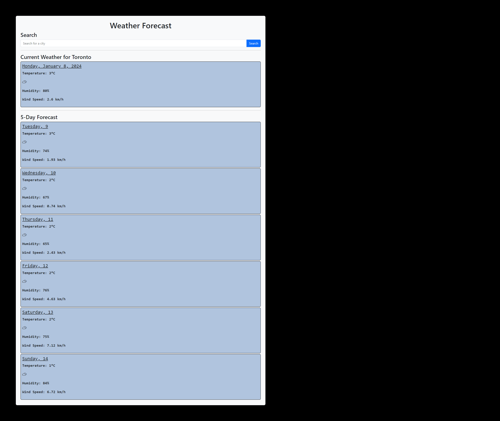

# 5-day-forecast



## Overview

5-day-forecast is a web application that gets the weather forecast for the next 5 days for a specified location.

This web app uses the [OpenWeatherMap API](openweathermap.org) to retrieve the weather.

[Link to Website](https://blockdoyle.github.io/5-day-forecast/)

## Table of Contents

- [5-day-forecast](#5-day-forecast)
  - [Overview](#overview)
  - [Table of Contents](#table-of-contents)
  - [Installation](#installation)
  - [Usage](#usage)

## Installation

Install the code by either downloading the source files manually, or by using 'git clone'.

```bash
git clone https://github.com/blockdoyle/5-day-forecast.git
```

## Usage
To view the webpage, either double-click the 'index.html' file, open a live server using Visual Studio Code, or add the files to your Apache HTTP server.